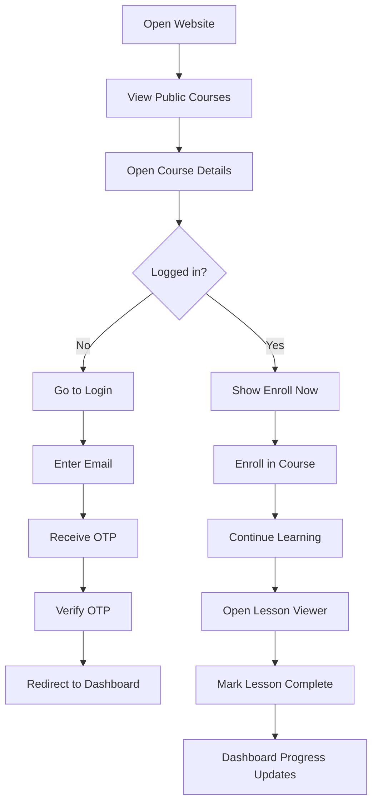
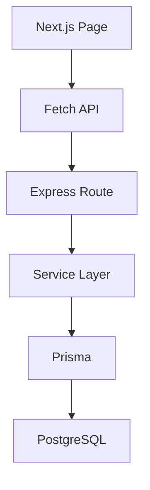

# Assignment

A simple full-stack course platform built with:

- Next.js App Router
- Tailwind CSS
- Node.js + Express
- Prisma + PostgreSQL
- Email OTP login

## What This App Does

Users can:

- browse public courses
- open course details and see chapters plus lessons
- login with email OTP
- enroll in a course
- view enrolled courses on dashboard
- mark lessons as complete

## Project Structure

- `backend/` - Express API, Prisma schema, auth, courses, and dashboard logic
- `frontend/` - Next.js frontend, course pages, dashboard, and lesson viewer

## Simple User Flow



## Backend Flow



## Main Pages

- `/login` - email OTP login
- `/courses` - public course catalogue
- `/courses/[id]` - course details with chapters and lessons
- `/dashboard` - enrolled courses and progress
- `/courses/[id]/lessons/[lessonId]` - lesson viewer

## Setup

1. Install dependencies.

```bash
npm install
```

2. Create env files.

- copy `backend/.env.example` to `backend/.env`
- copy `frontend/.env.example` to `frontend/.env.local`

3. Start PostgreSQL.

```bash
docker compose up -d
```

4. Prepare the database.

```bash
npm run seed
```

5. Start the apps.

```bash
npm run dev:backend
npm run dev:frontend
```

## Environment Variables

### Backend

- `DATABASE_URL`
- `JWT_SECRET`
- `AUTH_COOKIE_NAME`
- `FRONTEND_URL`
- `MOCK_OTP`
- `SMTP_HOST`
- `SMTP_PORT`
- `SMTP_SECURE`
- `SMTP_USER`
- `SMTP_PASS`
- `SMTP_FROM`

### Frontend

- `NEXT_PUBLIC_BACKEND_URL`

## Notes

- If SMTP is not set, the backend still works in dev mode and returns a `devOtp`.
- Lesson completion is saved in the database, not in browser state.
- The frontend only talks to the Express API. It does not access Prisma directly.

